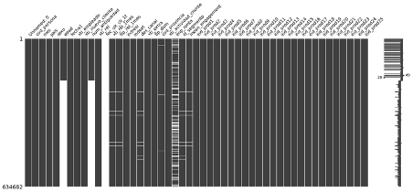
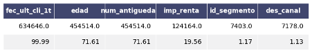
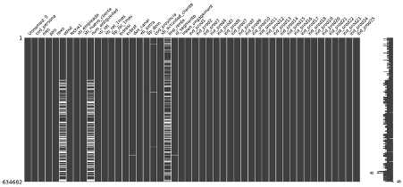
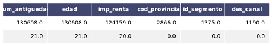

**Machine Learning Project: Recommender System**

Daniel Marchán, Francisco Álvarez, Yijie Hsieh, Jaime Fanjul

**Summary**

This is a project that aims at building a recommendation system to recommend new products out of the 25 available ones to a total of 46779 users.

The available information we have includes:

- Users&#39; characteristics such as country, gender, age...etc.
- Users&#39; historical purchase records on a monthly basis during the time range from January 2015 to April 2016.

Based on the information we have and our understanding of a recommendation system, we decided to run 3 models to the dataset plus 1 model that takes into account all 3 models&#39; results. This is because we would like to know if the purchase behavior of the users is more affected by the users&#39; characteristics, or by those who share similar purchase behaviors. Apart from that, we also implemented a non-personalized recommendation model that, in any case, would be a good indication, especially under the situation when there&#39;s not much data for us to rely on. Finally, we made predictions based on these 4 models and compared the MAP (Mean Average Precision) score among these 4 models to reach our conclusion of this project.

The steps to carry out this project at a higher level point of view are as follows:

Step 1. Data Exploration and Data Preprocessing

Step 2. Model Selection and Application

Step 3. Prediction and Model Evaluation

**Data Exploration &amp; Data Preprocessing**

In the dataset, there are user-related features as input variables and 25 columns of product active information as output variables. At the first glance of the dataset, we noticed that the first column &#39;Unnamed: 0&#39; is merely the index of the dataset and it has no specific value for the prediction, so we removed this column.

In order to understand the data of the other user-related features columns, a for-loop is created that prints out all unique values in columns that are of our interest. This helped us identify the types and quality of the data as following:

**Data  Types**

| Categorical Variables | Numerical Variables |
| --------------------- | ------------------- |
|  pais                 |  edad      
|  sexo                 |  num\_antiguedad
|  xti\_empleado        |  imp\_renta
|  xti\_nuevo\_cliente  |  mean\_engagement
|  xti\_rel\_1mes
|  tip\_rel\_1mes
|  indresi
|  indext
|  des\_canal
|  des\_canal
|  xti\_extra
|  tip\_dom
|  cod\_provincia
|  xti\_actividad\_cliente
|  id\_segmento                     |

**Data Quality**

- As &#39;num\_antiguedad&#39; is the customer seniority in months, we expect that it is the difference between column &#39;fecha1&#39; and &#39;mes&#39;, yet there are some discrepancies. So we decided to remove this column and create a new column that&#39;s also called &#39;antiguedad\_meses&#39; and takes the difference between column &#39;fecha1&#39; and &#39;mes&#39;.
- In the &#39;edad&#39; columns, quite some values are characters, even the nan values are shown as &#39; NA&#39; with spaces. Under this case, the &#39; NA&#39; wouldn&#39;t be identified as null values, so we have to correct this issue by removing the spaces and replacing the value with np.nan. Then we changed the dtype of this column to integer.
- Column &#39;tip\_dom&#39; only has values 1 and NaNs, so it doesn&#39;t make sense to include it to the dataset. We decided to drop this column too.

**Data Visualization**

Once the above issues have been resolved, we visualized the categorical and numerical variables. We ran 2 for loops with seaborn countplot for categorical variables and violinplot for numerical variables. From the graphs, we observed that there is 1 (or 2) particular value(s) that take(s) up more than 99% of the values in several columns. For example:

- More than 99% of the values in column &#39;xti\_empeado&#39; are &#39;N&#39;.[[1]](#graph1)
- More than 99% of the values in column &#39;xti\_rel&#39; are 1. [[2]](#graph2)
- More than 99% of the values in column &#39;xti\_rel\_1mes&#39; are 1. [[3]](#graph3)
- More than 99% of the values in column &#39;pais&#39; are &#39;ES&#39;.
- More than 99% of the values in column &#39;indresi&#39; are &#39;S&#39; [[4]](#graph4)

For our models we needed only numerical values, therefore we had to one hot encode categorical variables. The information above throwed us some hints on how to deal with the poor variation on those variables. In order to reduce the dimensions when one hot encoding the dataset, we created a function called _make\_dummies_ that groups categories in categorical variables that take up to less than 1% of the values in a specific column and renamed them as &#39;others\_(name\_column)&#39;. Results showed that using this function reduced the dimensionality of less than 35 user based variables, in relation to the more than 200 features resulting from _.get\_dummies()_ old fashioned way.

**Missing Values**

After solving the issues in the values of the dataset, we checked the amount and percentage of the missing values in each column. Among all, the column &#39;fec\_ult\_cli\_lt&#39; has 99% of missing values, so we removed this column. [[5]](#graph5)[[6]](#graph6)

_Missing values Imputations_

We noticed that some missing values in the columns of user-related features can be found by other rows of the same users. For example, we can assume that the same user&#39;s &#39;sexo&#39; and &#39;pais&#39; would be the same. So we created a function (_smart\_imputer_) to fill out these missing values by checking if the data is available in other rows of the same users. After running this function, a lot of missing values were filled. [[7]](#graph7)[[8]](#graph8)

As for the rest of the missing values, we created functions (_categorical\_imputer_ and _numerical\_imputer_) to handle them. Basically, if they belong to categorical variables, we impute them by replacing it with the mode value of that column;if they belong to numerical variables, the Random Forest algorithm is applied to impute the missing values. Now wehave a dataset with 0 missing values.

**Data Format Correction**

After we had all missing values handled, we made sure that all variables&#39; formats are appropriate and corrected those that are not. Now we have a clean dataset (_df\_clean2.csv_) to run the models.

**Model Selection &amp; Application**

There are several modelling options when building recommendation systems. For this project, three approaches were selected:

1. User based model
2. Product based model
3. Most popular product model

The first two models base the recommendations on the similarities between customers. That is, the recommendations are inferred from the closeness between customers&#39; characteristics or their purchase history to other customers. When a set of individuals that are similar to another individual show a preference for a certain product, this product is then recommended, given that enough of these similar customers have purchased said product.

**User based model**

The first model uses the customers&#39; information to build a cosine similarity matrix, which stores information about the likeness between two clients. Individuals who have a score close to 1 are more similar and those who have a score close to -1 are dissimilar. From this matrix, and for each unique customer in the data, the 250 most similar individuals are selected. Prior to this selection of k-most similar individuals, the similarity matrix is subsetted in a way that only customers that have bought a product at least once are considered. From this information, the product purchase-history of these k-most similar individuals is extracted from the data. This subsetted purchase information is then summed column-wise and divided by the number of k-most similar individuals (in this case 250). The result of this operation is a number between 0 and 1, which can be interpreted as the probability that the customer, to whom the selected individuals are similar to, will purchase that same product. It is important to note that this is a considerable assumption. The affinity between the choices of individuals similar to another individual does not imply certainty that said individual will end up purchasing the same product. It does, however, imply that such recommendation is ostensibly a well-informed one.

The final step needed to build an array of recommendations for each customer in the data is to select a threshold for which a product is recommended or not. For this project, the roof of this threshold is set at 0.5, meaning that, at most, the products that 50% of the most-similar individuals have purchased, and which are different from the products already purchased by the individual to which these are similar to, are recommended. The reason for this is that there might be well-informed product recommendations that have not been purchased by more than 50% of the individuals selected as most similar. After a tuning step, where different thresholds were tested, the model which recommends products at a threshold of 50% was selected.

**Product based model**

The second model uses the information from the customers&#39; purchasing behaviour. In the same manner as with the user-based recommendation model, this product history-based recommendation model uses a cosine similarity matrix to generate the recommendations. Unlike the previous model, however, this model ignores customer information and instead takes only their last recorded purchase choices and treats these as a vector which is compared to others to find similarities between individuals.

Like the first model, this model looks for the most similar individuals based on their entry in the cosine similarity matrix. Once these individuals have been spotted, their purchasing information is subsetted from the data. This time 500 individuals were selected instead of 250. The reason for this is the lower variability of purchasing behaviour compared to individuals&#39; characteristics. The subsetted purchasing information is summed column-wise and divided by the number of individuals selected. This creates an array of probabilities for the recommendation of all products. In the same manner as in the first model, the threshold to decide on making or not a recommendation was locked at 0.5 and, through model tuning, it was found that again 0.5 gives the best results.

It is important to note that the recommendation arrays obtained from the previously detailed process are still &quot;raw&quot; in the sense that they are likely to contain within them recommendations for products that the customer has already bought. Since the goal of the recommendation system is to suggest new products, a mask needs to be applied to these raw recommendations before these can be used.

**Most popular product model**

Instead of looking for similarities between users, this model is a non-personalized recommendation system that always recommends n (n=1 for this project) most bought products to an individual under the condition that this product hasn&#39;t been bought by this user. We decided to only recommend 1 because through different testing of the amount of product to recommend, it gives the best result. The popularity of the products are calculated by summing up the amount of times it has been purchased since the very beginning, then we ranked the products from 1 to 25 based on the purchase times. This model would always recommend the 1 product following the order of the popularity (ranking).

**Intelligent recommendation system**

Having 3 models available to make predictions, we created this intelligent recommendation system that takes into account all models mentioned above. Briefly speaking, this system calculates the average likelihood that a user purchases a product or not by summing up the recommendation output of each product from all 3 models and dividing them by 3. If the likelihood is higher than 50% then this system would recommend this product to this user, if lower, then not.

**Model Evaluation**

The evaluation metric chosen for testing our algorithm is MAP or Mean Average Precision. It measures how many of the recommendations that our model made are actually correct and how well it finds these recommendations.

The average of AP (Average Precision) is calculated over all users, we compute the average precision value for each user-recommendation and average them. To do this, the list of recommendations for the 25 products for each user is taken and compared with a list of the true set of products purchased by the user that month. So the function positively rewards the correct recommendations, that is, recommending the products that the user actually bought that month.

As a total of 4 different recommendation methods have been implemented, it has been necessary to make adjustments. Loops have been made that takes into account the predictions of the 4 models, returning the corresponding score of each one. In order to iterate over different prediction lists and get the appropriate results, it was necessary to store the scores in new lists and calculate the mean over them.

The results obtained for April 2016 are the following:

| **Method**                            | **MAP Score** |
| ------------------------------------- | ------------- |
| **Product Based Model**               | **0.905**     |
| User Based Model                      | 0.773         |
| Most Popular Product Model            | 0.897         |
| **Intelligent recommendation system** | **0.893**     |

The best result is obtained by the product popularity-based method, notably highlighting the performance of the rest of the models used. Nevertheless, we consider that the intelligent method is more robust to variation when weighting between different models, due to the fact that when using different methods (models) based on independent mathematical approaches, the noise in prediction (variance) that each model may have is canceled (similar to the concept used in Random Forest), so to speak, taking into account only that in which everyone agrees. The key to these results is in the exhaustiveness of the data analysis to form a brilliant logic used in the construction of the different similarity matrices.

Finally the predictions of the 4 models are saved in the corresponding .csv files using the client code as index.

**Appendix**

Graph 1: Countplot of categorical variable: xti\_empleado

Graph 2: Countplot of categorical variable: xti\_rel

Graph 3: Countplot of categorical variable: xti\_rel\_1mes

Graph 4: Countplot of categorical variable: indresi

Graph 5: Missing Values in Original Dataset

Graph 6: Columns with plenty of missing values

Graph 7: Missing Values after running smart\_imputer function

Graph 8: Columns with plenty of missing values in the beginning

